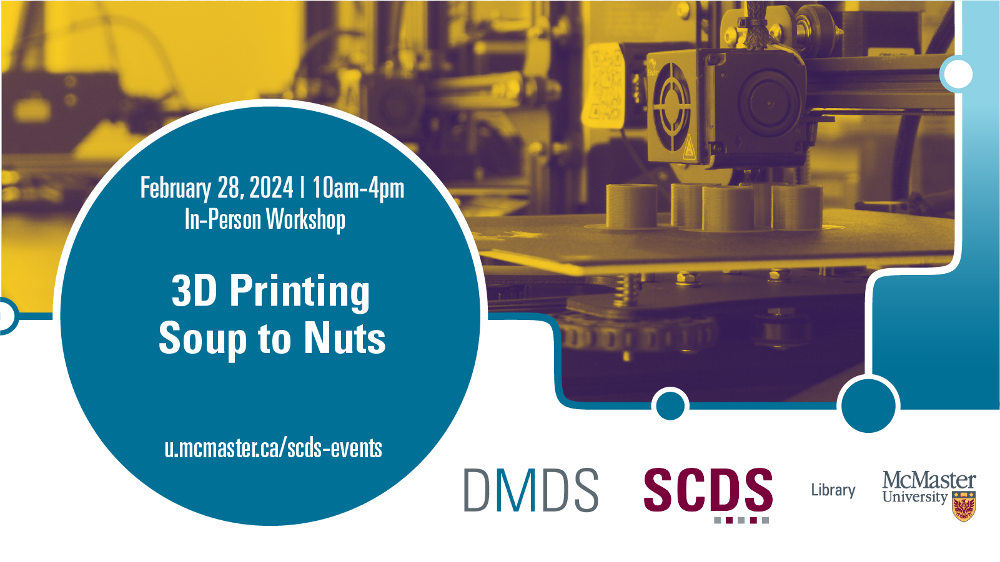

This is a day-long workshop that will explore 3d modelling and printing. We'll take a physical object from the real world, use a series of sophisticated software to render it into a 3d model, and then learn how to print that model on a 3d printer.

Preliminary Work/Prerequisites: Bring a phone and please download the Widar app for 3D modelling. Bring a small object to model.

Facilitator Bios: John Fink is Digital Scholarship Librarian at McMaster University. Britt Sostar is Makerspace Coordinator at Thode Library in McMaster University.

# Workshop preparation 

Coming Soon
  
# Workshop Recording

Coming Soon

# Workshop Slides

Coming Soon

# Links and Resources 

Coming Soon
