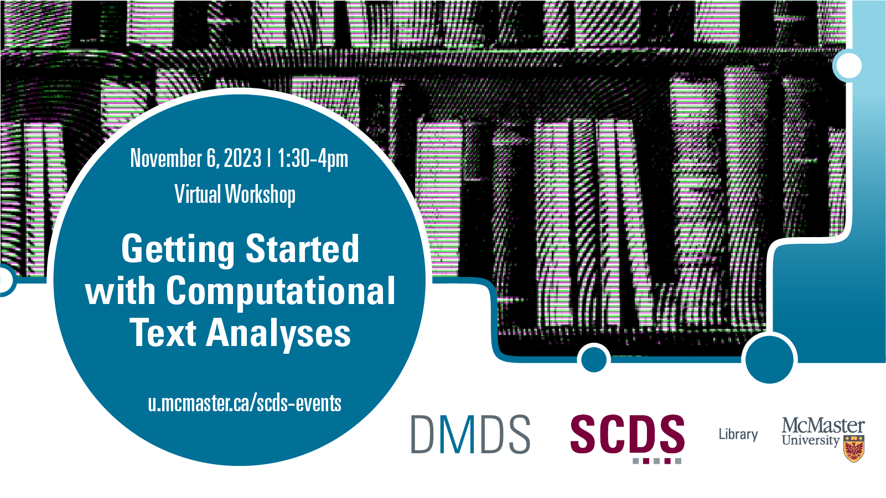

# Computational Text Analyses - Bootcamp Edition

Do you have a textual analysis project that you are trying to get off the ground? Or are you simply interested in learning more about how to analyze texts with computers? Join us for an intensive - but fun! - bootcamp at the Sherman Centre with opportunities to work on your own documents or a sample corpus if you just want to practice the techniques.  

Through hands-on exercises, we will introduce to the fundamental concepts, processes, and methodological approaches for preparing and analyzing text using computational approaches. We'll show you how to use tools like OpenRefine and Python for text preparation and introduce analytic techniques including named entity recognition (NER), topic modeling, sentiment analysis and stylometry.
Participants are not expected to have any pre-requisite knowledge of text preparation and analysis, but experience with Python is an asset. Participants will be given an opportunity to complete exercises in advance of the workshop to build basic competency. 

**This is an in-person event** and open to all who are able to travel to the Sherman Centre, which is accessibly located on the first floor of Mills Library at McMaster University.

## Workshop Preparation 
In this workshop, we will use the following tools and platforms: 
- [Google Colab](https://colab.google/), which requires a Google account. If this poses a challenge, please reach out to the [Sherman Centre](mailto:scds@mcmaster.ca) for alternative arrangements. 
- [OpenRefine](https://openrefine.org/): [Download](https://openrefine.org/download) and install prior to the first session.
- [Constellate.org](https://constellate.org/), which is available to all McMaster members, as well as members of other institutions. If you do not have access, please contact the [Sherman Centre](mailto:scds@mcmaster.ca) for alternative arrangements.

<!-- 
All of the materials for this workshop are available at this [shared Google Drive Folder](https://u.mcmaster.ca/dmds-text-2324). If you are unable to access the Google Drive folder, the workshop materials may also be found [here](https://github.com/scds/dmds23-24/tree/main/textanalyses)--these can be uploaded into Google Colab or another Jupyter Notebook instance.
-->

## Facilitator Bios

Devon Mordell is an Educational Developer at The MacPherson Institute for Teaching and Learning. Devon draws on her experience in media art, hobbyist programming and instructional design to teach workshops for the Sherman Centre. Her areas of interest in digital scholarship include data visualization, computational analyses of texts, sonification and critical digital humanities. Her research practice explores the algorithmic culture industry and platform psychogeography.

Jay Brodeur (he/him) is the Director of Digital Scholarship Infrastructure & Services and the Administrative Director of the Sherman Centre for Digital Scholarship. Jay has years of experience working with data in a wide variety of formats and interdisciplinary contexts. A scientist by training with a PhD in Earth and Environmental Sciences, he’s comfortable working and advising on all kinds of data-related activities, ranging from data wrangling and integration to analysis and mapping to research data management. Jay’s also keenly interested in the application of digital approaches to support experiential learning opportunities within and outside of the classroom.

## Contents

### Day 1
Time: 0930 - 1600
|Segment|Time Allotted|Key Topics / Activities|
|:--|:--|:--|
|**Introductory remarks**|20 minutes|Introduction to text preparation and analysis   Overview of concepts and methods|
|**Text preparation**|120 minutes|Text prep with OpenRefine   Building workflows with Python|
|**Lunch**|60 minutes|**Lunch**|
|**Text Analysis**|180 minutes|Named Entity Recognition   Sentiment Analysis   Topic Modeling   Stylometry|

### Day 2
|Segment|Time Allotted|Key Topics / Activities|
|:--|:--|:--|
|**Corpora Selection**|30 minutes|Sources and types   Key considerations for different source materials and analyses   case studies|
|**Working Period**|120 minutes|Work on your own data or a pre-selected project|
|**Lunch**|10 minutes|**Lunch**|
|**Visualization for Dissemination** |90 minutes|Core concepts   Visualization types   hands-on exercises|
|**Working Period**|60 minutes|Continue project work|
|**Share Back, Closing Comments**|20 minutes|Share your work   Questions and wrap-up|

## Workshop Materials
*Coming soon.*

<!--
All of the materials for this workshop are available in this [shared Google Folder](https://u.mcmaster.ca/dmds-text-2324). Note that the shared folder includes an additional notebook, which Devon created to demonstrate performing [Named Entity Recognition on a series of documents](https://colab.research.google.com/drive/1BC18oDNM9c9x5VMwzI4VPaapjCbEXYio?usp=sharing). If you are unable to access the Google Drive folder, the workshop materials may also be found [here](https://github.com/scds/dmds23-24/tree/main/textanalyses)--these can be uploaded into Google Colab or another Jupyter Notebook instance.

<embed src="assets/docs/textAnalysisSlides.pdf" style="border:none;" width="100%" height="466px">
[Download as PDF.](assets/docs/textAnalysisSlides.pdf)

-->

## Links and Resources 
*Coming soon.*

<!--
- [Constellate](https://constellate.org/) is a text analysis learning and analysis platform supported by JSTOR Labs and ITHAKA. 
-->
