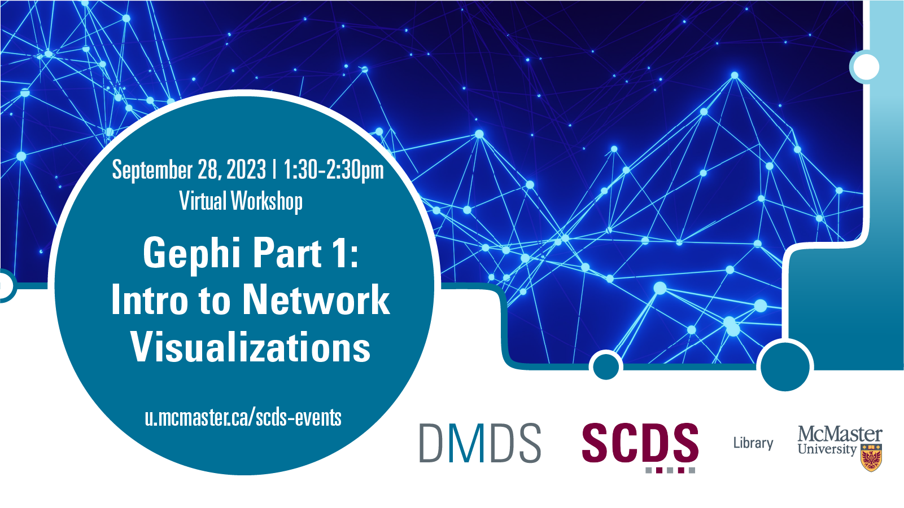

Learn to graph data and visualize networks at this virtual workshop on Gephi. Participants will learn how graph data can help express relationships between entities and visualize networks for Humanities scholars. The group will use a visualization tool intended for social network analysis to map and identify relationships.

Preliminary Work/Prerequisites: Participants may download Gephi ahead of time, though there will be time during the workshop to download the program as well.

Facilitator Bio: Subhanya Sivajothy (she/her) brings a background of research in data justice, science and technology studies, and environmental humanities. She is currently thinking through participatory data design which allow for visualizations that are empowering for the end user. She also has experience in Research Data Management—particularly data cleaning and curation. Do not hesitate to reach out to her if you would like to talk more about data analysis and visualization as they evolve throughout the research process. Contact Subhanya at sivajos@mcmaster.ca.

# Workshop preparation 

Coming Soon
  
# Workshop Recording

Coming Soon

# Workshop Slides

Coming Soon

# Links and Resources 

Coming Soon
