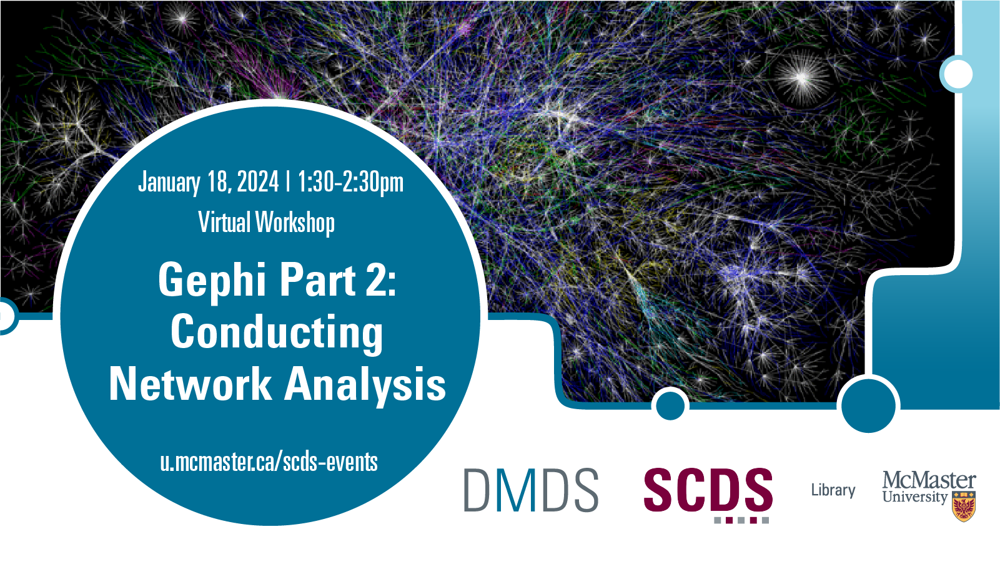

# Gephi Part 2: Conducting Netwrok Analysis

This workshop will build on the [Fall 2023 workshop "Gephi Part 1: Introduction to Network Visualizations"](gephi1) to look at how one can conduct network analysis for research. We will go through a case example together and discuss more features that researchers can use to design their own network visualizations.

[Register for this workshop](https://libcal.mcmaster.ca/event/3738763){: .btn .btn-outline }

## Workshop Preparation 

Participants may download [Gephi](https://gephi.org/) ahead of time, though there will be time during the workshop to download the program as well. 

All participants should watch the recording of the [Fall 2023 workshop "Gephi Part 1: Introduction to Network Visualizations"](gephi1).

## Facilitator Bio

Subhanya Sivajothy (she/her) brings a background of research in data justice, science and technology studies, and environmental humanities. She is currently thinking through participatory data design which allow for visualizations that are empowering for the end user. She also has experience in Research Data Management—particularly data cleaning and curation. Do not hesitate to reach out to her if you would like to talk more about data analysis and visualization as they evolve throughout the research process.

<!-- # Workshop Recording

Coming Soon

# Workshop Slides

Coming Soon

# Links and Resources 

Coming Soon -->
