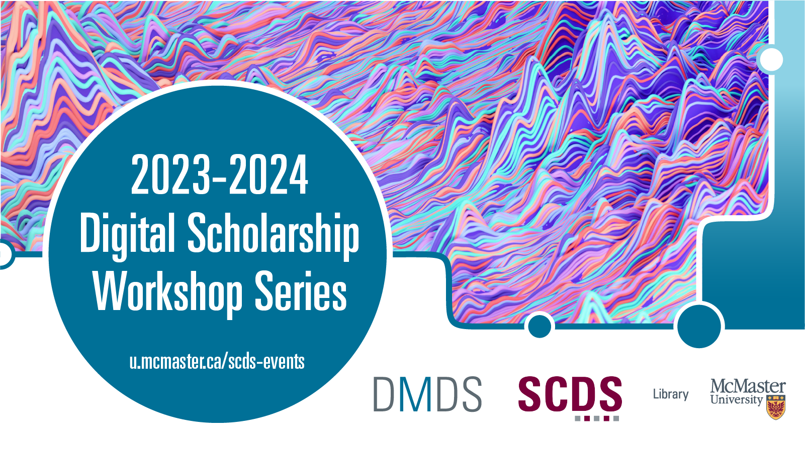

# Welcome to the 2023-2024 Do More with Digital Scholarship Webinars

What is digital scholarship, how can I do more with it, and how can it contribute to my research and teaching? Join us for our free workshop series that introduces McMaster students, faculty, and staff to the multifaceted domain of digital scholarship.

- Develop skills for professionalization.
- Learn to use software including Audacity, Gephi, Obsidian, OpenRefine, Python, Two Tone, and Voyant.
- Engage with faculty, staff, and students with all levels of technical expertise.
- Explore digital approaches to research and knowledge mobilization. 
- Discover opportunities for collaboration.

## 2023-24 DMDS Workshop Topics

This year's programming includes events on the following topics:
- Gephi 1: Intro to Network Visualizations
- Exploring Networks of Research: New Searching with AI and Visualization
- Getting Started with Computational Text Analyses
- Intro to Version Control with Git
- Less is More: Create Minimal Websites with Jekyll
- Enhancing Your Digital Exhibit: Customization and Interactive Elements in Omeka S
- Gephi 2: Conducting Network Analysis
- 3D Printing Soup to Nuts
- Preserving Your Digital Scholarship Projects
