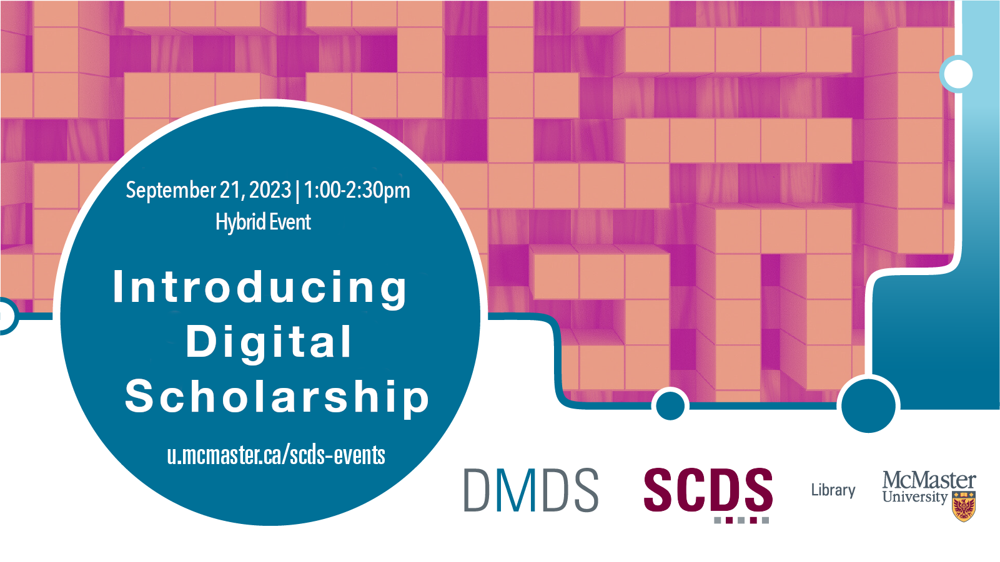

# Introducing Digital Scholarship 1: Podcasting, Born-Digital Publishing, and Social Media Research

In the first installment of this two-event series, learn more about the interdisciplinary, multifaceted and emergent approaches to digital scholarship from our 2023 Graduate Residency cohort.

[Register for this workshop](https://libcal.mcmaster.ca/event/3754451){: .btn .btn-outline }

  Presentations

- [The Rebellious Female Body: An Analysis of Street-based Nude Activism in Women, Life, Freedom Movement on Iranian Twittersphere](introdig/rebellious)
- [Navigating Platform (Dis)affordances: Rhetorics of Suspension](introdig/disaffordances)
- [Frontlines: Faces of the Climate Crisis](introdig/frontlines)
- [Evidence of Us: Exploring Potential Futures of the “Queer” Archive](introdig/evidence-of-us)

## Event Recording

<iframe height="416" width="100%" allowfullscreen frameborder=0 src="https://echo360.ca/media/bf65bc7a-f71e-43ea-b8e4-69e362c59783/public"></iframe>
[View original here.](https://echo360.ca/media/bf65bc7a-f71e-43ea-b8e4-69e362c59783/public)