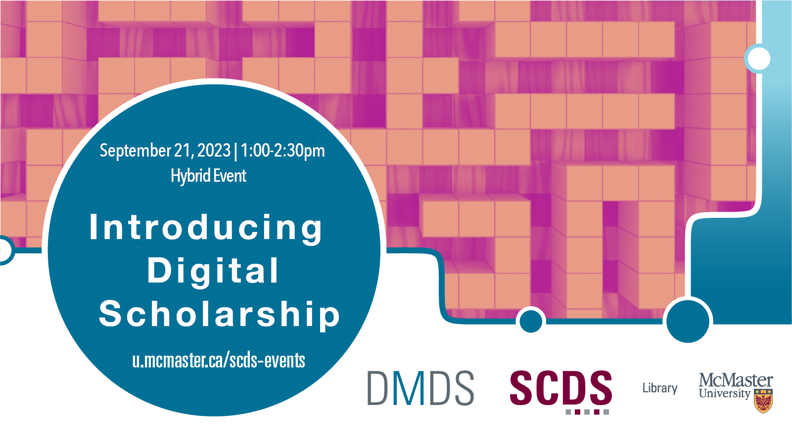

<!-- (September 21, 2023 | 1-2:30 p.m. ) -->

# The Rebellious Female Body: An Analysis of Street-based Nude Activism in Women, Life, Freedom Movement on Iranian Twittersphere

*The Rebellious Female Body* examines the efforts of two Iranian feminist activists who practiced street-based nude activism during the Women, Life, Freedom movement in 2022. These activists constructed a unique form of bodily resistance against various forms of state and social corporeal regulation imposed on Iranian women. In this talk, I will share preliminary findings of a discourse analysis of Iranian Twitter users' reactions to nude feminism. I will consider how the resuscitation of the naked female bodily protest is a transformative and transgressive tool within the Iranian women’s movement that has intensified the long resistances of Iranian women for corporeal autonomy.  

## Facilitator Bio

Niloofar Hooman (she/her) is a Ph.D. candidate in the Department of Communication Studies and Media Arts at McMaster University. She holds a Ph.D. in Communication (2019) from the University of Tehran, Iran. Her research encompasses theories of new media, digital activism, feminism, and critical studies of marginalized bodies. Her work has been published in New Media & Society, The International Journal of the Image, LGBTQ Digital Cultures, and The MeToo Movement in Iran; Reporting Sexual Violence and Harassment.