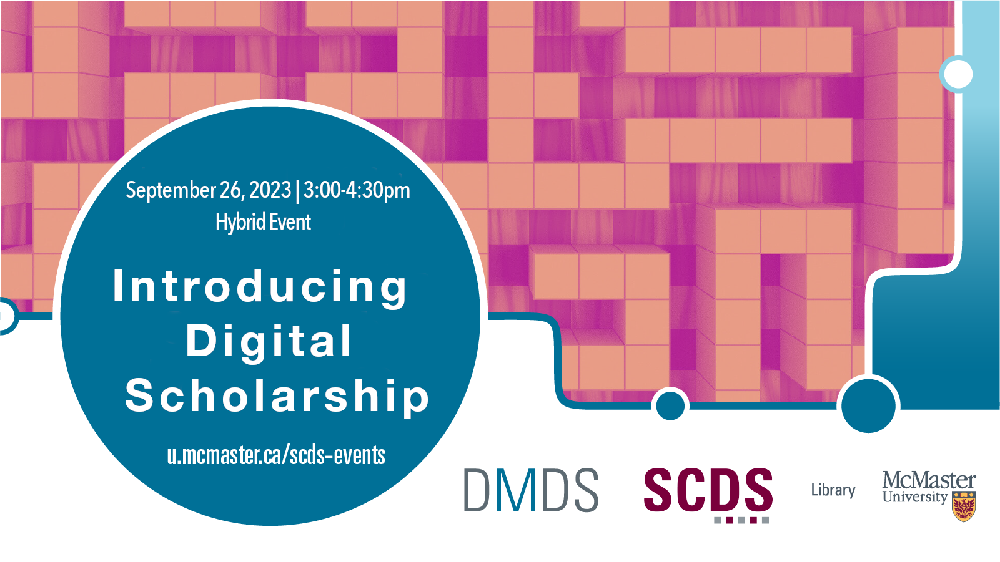

# Introducing Digital Scholarship 2: Interactive and Digital Storytelling, Digital Exhibits and Community Archiving

<!-- September 26, 2023 | 3-4:30 p.m.  -->

In the second installment of this two-event series, learn more about the interdisciplinary, multifaceted and emergent approaches to digital scholarship from our 2023 Graduate Residency cohort. 

  Presentations

- [Mobile Connexions and Material Culture](introdig2/connexions)
- [Narratives of War: A Virtual Exhibit of Ukrainian Testimonies](introdig2/narratives-of-war)
- [Recovering and Re-capturing Queer Historical Spaces in the “Hamilton 2SLGBTQ+ Community Archive”](introdig2/queer-historical-spaces)
- [From (Bi)nary to Bi+: Archiving Joyful Resistance in the Digital Landscape](introdig2/bi-plus)
- [Empowering Diversity in STEM Academia: Hoops and Lab Coat](introdig2/stem-diversity)

 
