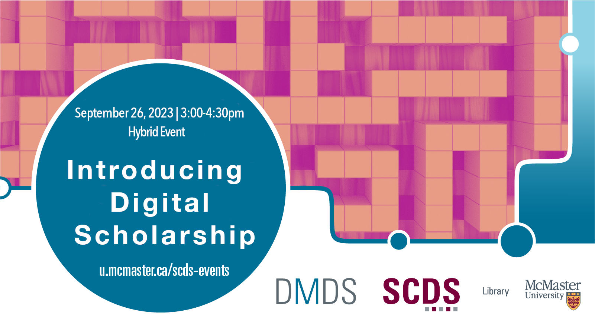

<!-- September 26, 2023 | 3-4:30 p.m.  -->

# Recovering and Re-capturing Queer Historical Spaces in the “Hamilton 2SLGBTQ+ Community Archive”

My project engages with oral histories and archival materials in the “Hamilton 2SLGBTQ+ Community Archive” to narrate Hamilton, Ontario’s queer cultural heritage and history from the 1970s to 1990s through a digital archive exhibit format. I focus specifically on queer historic spaces, such as dance halls, bars, cruising grounds, and sites of community organizing, to highlight the radical presence, resistance, and repositories of queer cultural memory and knowledge that endure in the archive and community today. My presentation reflects on how this archive is reimagined and reencountered through the Omeka S platform and digital storytelling methodologies grounded in space, place, and people. I demonstrate how audiovisual, written, and artistic parts are combined and explore the potential of digital storytelling as a counter-archival tool and mode for historicizing the past.  

## Facilitator Bio

Stephanie Rico (she/her) is a Ph.D. candidate in English and Cultural Studies and Gender and Social Justice at McMaster University. Her research focuses on local queer archives and life narratives, contemporary queer memoirs as critical modes of record-keeping, and contemplates what it means to convivir with the histories, traumas, and persons from the past.  

## Event Recording

<iframe height="416" width="100%" allowfullscreen frameborder=0 src="https://echo360.ca/media/0696cf37-a00a-4083-aa16-e0a23f7ee065/public"></iframe>
[View original here.](https://echo360.ca/media/0696cf37-a00a-4083-aa16-e0a23f7ee065/public)

## Additional Resources

- Building the Archive: <https://buildingthearchive.hamont.org/>
- Local History & Archives: <https://lha.hpl.ca/>