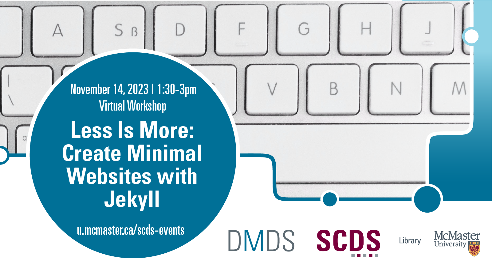

In this workshop, students will learn how to build a lightweight website using Jekyll and GitHub Pages.

Website-building platforms, like Squarespace and Wordpress, while convenient and user-friendly, can be costly, have limited customizability, and require continuous updates to stay afloat. Static sites, on the other hand, are pure html, css, and javascript. As such, they are free to build, endlessly customizable and, once generated, require little to no maintenance.

Jekyll is an open-source static site generator that offers the best of both worlds. In this workshop, students will start with a basic Jekyll website template. Then, we will walk through how to create and edit pages in Markdown, an easy to understand word processing language (like simpler html) that was created for blogging. Next we will explore how to customize the layout and design with CSS. Finally, students will learn how to deploy and host their finished site (for free!) on GitHub Pages.

Recommended Preliminary Work: Complete the Sherman Centre's [asynchronous learning module on Git](https://scds.github.io/github-pages/). 

Facilitator Bio: Chelsea Miya is a Postdoctoral Fellow with the Sherman Centre for Digital Scholarship at McMaster University. Her research and teaching interests include critical code studies, nineteenth-century American literature, and the digital humanities. She has held research positions with the SpokenWeb Network, the Kule Research Institute (Kias), and the Canadian Writing Research Collaboratory (CWRC). She co-edited the anthology Right Research: Modelling Sustainable Research Practices in the Anthropocene (Open Book Publishers 2021), and her article “Student-Driven Digital Learning: A Call to Action” appears in People, Practice, Power: Digital Humanities outside the Center (MIT Press 2021).

# Workshop preparation 

Coming Soon
  
# Workshop Recording

Coming Soon

# Workshop Slides

Coming Soon

# Links and Resources 

Coming Soon
