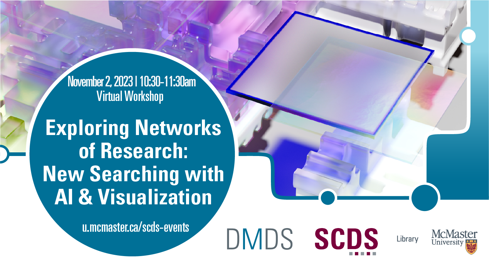

# Exploring Networks of Research: New Searching with AI & Visualization

Instead of retrieving articles by search terms, new tools allow one to explore publications through interactive visualizations. Learn how to navigate networks in Litmaps, Research Rabbit, Research Graph, and/or Citation Tree.

Note: This method is experimental, with no standardized results.

## Facilitator Bio

Jeffrey Demaine is McMaster University Library's Bibliometrics and Research Impact Librarian. He worked for a dozen years at the National Research Council, as a researcher in a German think-tank, and as the Bibliometrics librarian at the University of Waterloo. His recent publications reveal forgotten “Sleeping Beauty” articles, the changing gender distribution of Canadian researchers, and the effect of increased collaborations on the research impact of universities around the world. Beyond simply counting citations, Jeffrey parses the metadata of academic publications, examines the changing structure of science, and reveals the patterns that underly the work of McMaster’s researchers. He also co-organizes a [Canadian conference on Bibliometrics](https://www.bric-conference.ca/).

## Workshop Recording

<iframe height="416" width="100%" allowfullscreen frameborder=0 src="https://echo360.ca/media/20d15761-7165-44df-8f16-67419cdde75c/public"></iframe>
[View original here.](https://echo360.ca/media/20d15761-7165-44df-8f16-67419cdde75c/public)

<!-- 
## Links and Resources 

Coming Soon 
-->
