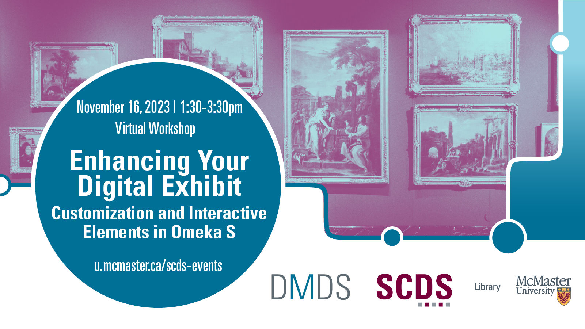

Create next level digital exhibits! We will use HTML5 to customize the appearance of your Omeka S digital exhibit and add interactive elements to your website. 

Preliminary Work/Prerequisites: This workshop is suited to folks who are already using Omeka S. If you would like to learn about the Omeka S digital exhibit platform, watch the Sherman Centre's asynchronous learning module ahead of this workshop and create an exhibit to work on. 

Facilitator Bio: Devon Mordell is an educational developer with the MacPherson Institute, drawing on her experience in media art, hobbyist programming and instructional design to teach workshops for the Sherman Centre. She has also trained as a digital archivist and given workshops on digital exhibits and computational text analysis for the Canadian archival community.

# Workshop preparation 

Coming Soon
  
# Workshop Recording

Coming Soon

# Workshop Slides

Coming Soon

# Links and Resources 

Coming Soon
