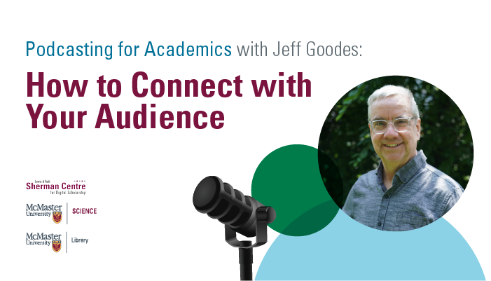

# Podcasting for Academics with Jeff Goodes: How to Connect with Your Audience

Podcasts can take academic research out of the ivory tower and into the public. Learn how to connect with your audience and build an online listenership at this roundtable discussion hosted by special guest Jeff Goodes, veteran CBC reporter and the 2023 journalist-in-residence for McMaster's Faculty of Science.
 
This speaker event is part of the Intro to Podcasting workshop series. These beginner-friendly sessions walk through each step of the production process: from conceptualising a story idea to recording interviews to sound design.

## Facilitator Bio

Jeff Goodes brings more than 25 years of award-winning experience as a reporter, host and producer with CBC. Jeff served for 10 years as the producer and senior producer with White Coat, Black Art, a radio documentary series on CBC Radio One hosted by Dr. Brian Goldman. Jeff was also the host and producer of Fresh Air, CBC Radio’s Ontario-wide weekend morning show from 1998 to 2008 and the creator and co-host of the comedy talk-show Scott Free Podcast with Scott Thompson of Kids in the Hall. Jeff began his journalism career in 1993 as a writer and broadcaster at CBC Winnipeg.

Jeff has also served as an instructor with CBC Learning, Toronto Metropolitan University and Mohawk College, and as a mentor with CBC’s Doc Mentorship Program. Jeff holds a Master’s in Learning and Technology from Royal Roads University and a Bachelor of Applied Arts from Toronto Metropolitan University.

## Event Recording

<iframe height="416" width="100%" allowfullscreen frameborder=0 src="https://echo360.ca/media/3a5bc184-0849-4971-b32d-87f19700e2c2/public"></iframe>
[View original here.](https://echo360.ca/media/3a5bc184-0849-4971-b32d-87f19700e2c2/public)

<!-- # Workshop preparation 

Coming Soon
  
# Workshop Recording

Coming Soon

# Workshop Slides

Coming Soon
-->

## Links and Resources 

- Science vs. Vaping: <https://gimletmedia.com/shows/science-vs/6nh3veng>
