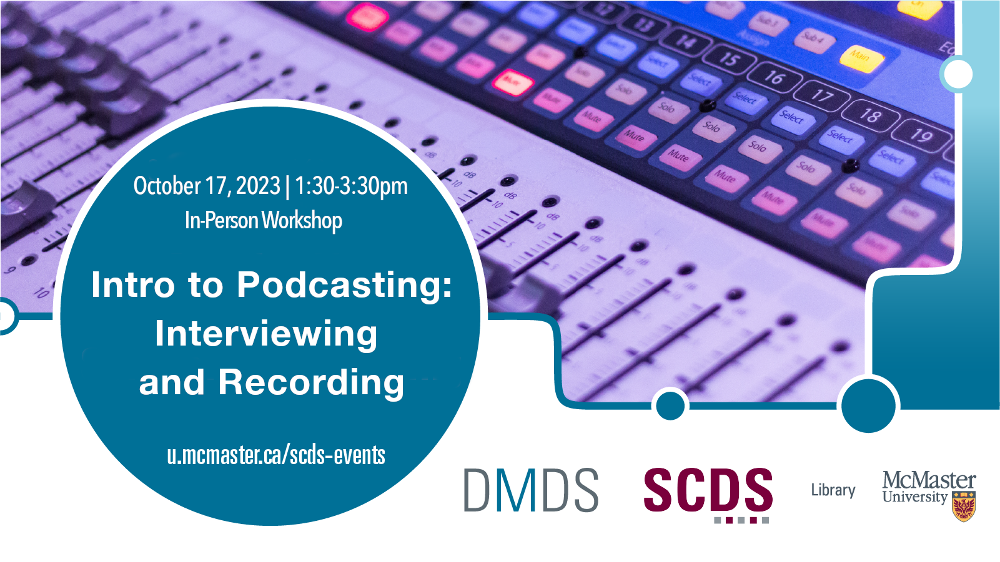

# Intro to Podcasting: Interviewing and Recording

Podcasts can take academic research out of the ivory tower and into the public. Learn how at this beginner-friendly workshop. Participants will create a 5-minute research story and, in the process, gain hands-on experience producing podcasts, from pitching an idea to building an online listenership. The Intro to Podcasting series will be split into two parts. This first session will introduce participants to the art of interviewing, as well as tips and tricks for recording studio-quality sound using the Lyons New Media Centre recording booths.

**Veteran radio journalist Jeff Goodes, producer of CBC's White Coat, Black Art and McMaster's 2023 journalist-in-residence, will host a 1-hr roundtable discussion prior to the workshop from 12:30-1:20pm in the Sherman Centre.*

## Facilitator Bio

Chelsea Miya is a Postdoctoral Fellow with the Sherman Centre for Digital Scholarship at McMaster University. Her research and teaching interests include critical code studies, nineteenth-century American literature, and the digital humanities. She has held research positions with the SpokenWeb Network, the Kule Research Institute (Kias), and the Canadian Writing Research Collaboratory (CWRC). She co-edited the anthology Right Research: Modelling Sustainable Research Practices in the Anthropocene (Open Book Publishers 2021), and her article “Student-Driven Digital Learning: A Call to Action” appears in People, Practice, Power: Digital Humanities outside the Center (MIT Press 2021).
