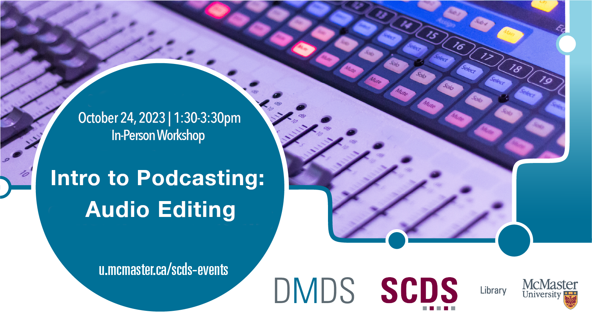

# Intro to Podcasting: Audio Editing

This second session of the two-part Intro to Podcasting series will explore how to tell stories through sound using the free audio editing software Audacity. Participants will learn the basics of audio cleanup and sound design, as well as how to access streaming services so your podcast can reach a wider audience.

Make sure to register for the first session, [Intro to Podcasting: Interviewing and Recording](podcast1).

[Register for this workshop](https://libcal.mcmaster.ca/event/3754423){: .btn .btn-outline }

## Facilitator Bio

Chelsea Miya is a Postdoctoral Fellow with the Sherman Centre for Digital Scholarship at McMaster University. Her research and teaching interests include critical code studies, nineteenth-century American literature, and the digital humanities. She has held research positions with the SpokenWeb Network, the Kule Research Institute (Kias), and the Canadian Writing Research Collaboratory (CWRC). She co-edited the anthology Right Research: Modelling Sustainable Research Practices in the Anthropocene (Open Book Publishers 2021), and her article “Student-Driven Digital Learning: A Call to Action” appears in People, Practice, Power: Digital Humanities outside the Center (MIT Press 2021).

<!-- # Workshop preparation 

Coming Soon
  
# Workshop Recording

Coming Soon

# Workshop Slides

Coming Soon

# Links and Resources 

Coming Soon -->
