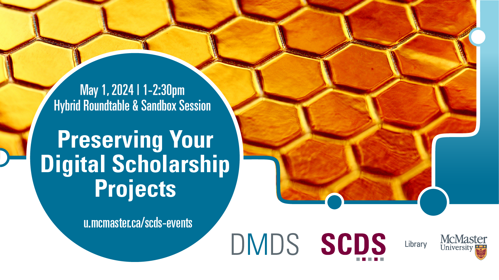

# Preserving Your Digital Scholarship Projects

Don't lose all that hard work you've put into creating a digital scholarship project! With all the moving parts involved, digital scholarship projects can “break” two or three years after completion when preservation concerns aren’t considered. Websites require maintenance, platforms like Omeka and StoryMaps need version updates, file formats become obsolete – making projects interactive and accessible over the long-term can be complex.

In this roundtable discussion, we’ll explore challenges in preserving digital scholarship projects, as well as tools & approaches to supporting their long-term access and use. We’ll conclude with a sandbox session where we share case studies and respond to participant questions.

[Register for this workshop](https://libcal.mcmaster.ca/event/3749783){: .btn .btn-outline }

## Facilitator Bios

Danica Evering holds expansive experience with research support, education, project management, advocacy, and knowledge translation; with fluency in social practice art, healthcare, community research, data, and systems development. Danica supports students, postdocs, faculty, and staff with RDM through the data lifecycle—Data Management Plans, storage and backup, data security, data sharing. With an MA in Media Studies from Concordia, they are interested in fostering RDM within curious scholars and disciplines.

John Fink's (he/they) talents lie in complex and innovative systems administration and project management. He also has an interest in the maker/hacker element in digital scholarship, and is frequently spotted tinkering with esoteric hardware. If you are interested in having the Sherman Centre support your project, John is an excellent first contact.

Isaac Pratt (he/him) is a research scientist by training and has a PhD in Anatomy & Cell Biology. He leverages nearly a decade of interdisciplinary research experience to help support students, staff, and faculty. His expertise lies in questions surrounding data storage, security, planning, archival, and sharing. Isaac also provides support and curation services for McMaster Dataverse. His other interests include reproducible research methods, open science, and data science. Bridget Whittle is the Digital Archives Librarian and has worked at McMaster since 2012. Bridget holds an MA in Medieval Studies and a MISt in Archives and Records Management from the University of Toronto. The focus of her work touches on the many places the digital world and archives intersect--archiving born-digital content, managing digitized materials, and exploring new tools created by technology to explore and expand our access to archival material.

Isaac Pratt (he/him) is a research scientist by training and has a PhD in Anatomy & Cell Biology. He leverages nearly a decade of interdisciplinary research experience to help support students, staff, and faculty. His expertise lies in questions surrounding data storage, security, planning, archival, and sharing. Isaac also provides support and curation services for McMaster Dataverse. His other interests include reproducible research methods, open science, and data science.

Bridget Whittle is the Digital Archives Librarian and has worked at McMaster since 2012. Bridget holds an MA in Medieval Studies and a MISt in Archives and Records Management from the University of Toronto. The focus of her work touches on the many places the digital world and archives intersect--archiving born-digital content, managing digitized materials, and exploring new tools created by technology to explore and expand our access to archival material.

<!-- # Workshop Preparation 

Coming Soon
  
 # Workshop Recording

Coming Soon

# Workshop Slides

Coming Soon

# Links and Resources 

Coming Soon -->
