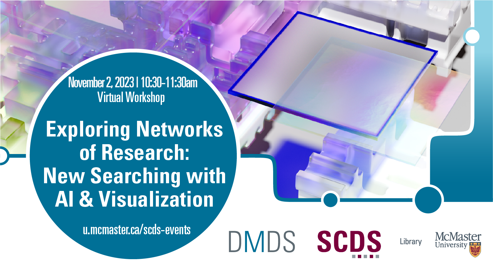

# Exploring Networks of Research: New Searching with AI & Visualization

Research literature is usually found using search terms. New tools allow one to explore publications through interactive visualizations. Learn how to navigate networks in Litmaps, Research Rabbit, Research Graph, and/or Citation Tree.

<!-- ## Facilitator Bio

Subhanya Sivajothy (she/her) brings a background of research in data justice, science and technology studies, and environmental humanities. She is currently thinking through participatory data design which allow for visualizations that are empowering for the end user. She also has experience in Research Data Management—particularly data cleaning and curation. Do not hesitate to reach out to her if you would like to talk more about data analysis and visualization as they evolve throughout the research process. Contact Subhanya at [sivajos@mcmaster.ca](mailto:sivajos@mcmaster.ca). -->

<!-- ## Workshop Preparation 

Participants may download [Gephi](https://gephi.org/) ahead of time, though there will be time during the workshop to download the program as well. -->
  
<!-- # Workshop Recording

Coming Soon

# Workshop Slides

Coming Soon

# Links and Resources 

Coming Soon -->
