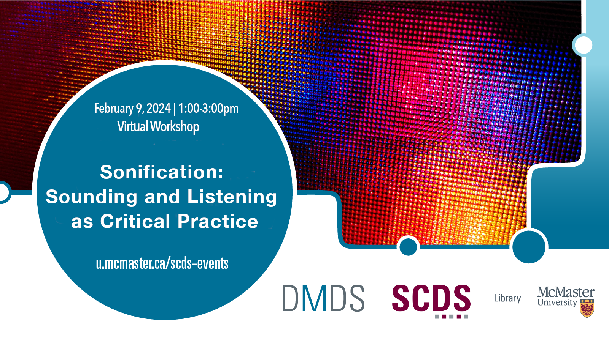

# Sonification: Sounding and Listening as Critical Practice

The sounds of data are all around us: from phone notifications to car horns to the whistle at a sports game. In this two-part workshop, participants will be introduced to the theory and practice of data sonification. We will briefly delve into the history of sonification and think through the unique ways that humans process and communicate sonic information. In the first session, through interactive exercises, like virtual sound walks, participants will be introduced to approaches and theories of listening to sound critically and reflectively.

Register for the second session here: [Sonification: Communicating Data with Sound](sonification2)

[Register for this workshop](https://libcal.mcmaster.ca/event/3754439){: .btn .btn-outline }

## Facilitator Bios

Subhanya Sivajothy (she/her) brings a background of research in data justice, science and technology studies, and environmental humanities. She is currently thinking through participatory data design which allow for visualizations that are empowering for the end user. She also has experience in Research Data Management—particularly data cleaning and curation. Do not hesitate to reach out to her if you would like to talk more about data analysis and visualization as they evolve throughout the research process.

Chelsea Miya is a Postdoctoral Fellow with the Sherman Centre for Digital Scholarship at McMaster University. Her research and teaching interests include critical code studies, nineteenth-century American literature, and the digital humanities. She has held research positions with the SpokenWeb Network, the Kule Research Institute (Kias), and the Canadian Writing Research Collaboratory (CWRC). She co-edited the anthology Right Research: Modelling Sustainable Research Practices in the Anthropocene (Open Book Publishers 2021), and her article “Student-Driven Digital Learning: A Call to Action” appears in People, Practice, Power: Digital Humanities outside the Center (MIT Press 2021).

Andrea Zeffiro (she/her) is an Associate Professor in critical technology studies in the Department of Communication Studies and Media Arts and an affiliate faculty member in the Master of Public Policy in Digital Society program and the Cultural Studies and Critical Theory MA program. Andrea received a Ph.D. in Communication Studies from Concordia University and was a postdoctoral fellow at the School of Interactive Arts and Technology at Simon Fraser University. Andrea’s current areas of research and teaching include critical data studies, data justice, critical cybersecurity studies, qualitative digital research methods, and critical and speculative design.

<!-- # Workshop preparation 

Coming Soon
  
# Workshop Recording

Coming Soon

# Workshop Slides

Coming Soon

# Links and Resources 

Coming Soon -->
