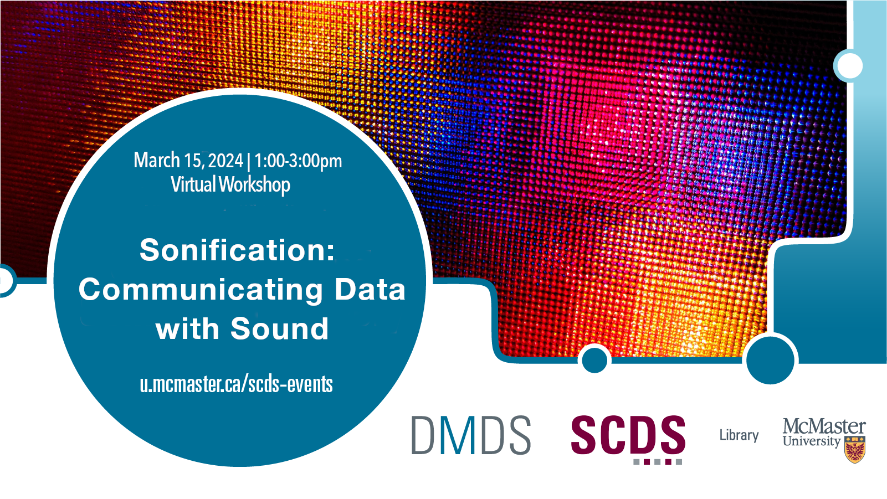

# Sonification: Communicating Data with Sound

In this two-part workshop, participants will be introduced to the theory and practice of data sonification. Most of us are familiar with data visualizations like graphs, charts, and maps. How might we communicate and engage with data differently through sound as opposed to visuals? In the second session, we will examine what sonification can do, the different types of sonification, and the types of data that work best in sound. We will put theory into practice and experiment with communicating data through sonification tools like TwoTone.

<!-- ## Facilitator Bios

Chelsea Miya is a Postdoctoral Fellow with the Sherman Centre for Digital Scholarship at McMaster University. Her research and teaching interests include critical code studies, nineteenth-century American literature, and the digital humanities. She has held research positions with the SpokenWeb Network, the Kule Research Institute (Kias), and the Canadian Writing Research Collaboratory (CWRC). She co-edited the anthology Right Research: Modelling Sustainable Research Practices in the Anthropocene (Open Book Publishers 2021), and her article “Student-Driven Digital Learning: A Call to Action” appears in People, Practice, Power: Digital Humanities outside the Center (MIT Press 2021). -->

<!-- # Workshop preparation 

Coming Soon
  
# Workshop Recording

Coming Soon

# Workshop Slides

Coming Soon

# Links and Resources 

Coming Soon -->
