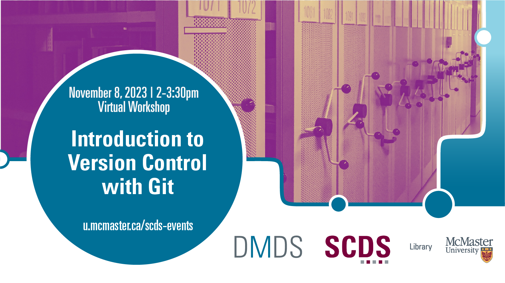

# Introduction to Version Control with Git

This workshop will give you a solid introduction to Git. Git is software originally designed to help manage vast, decentralized software projects with hundreds of authors, but it works just as well with many things that aren’t software, like data and text. Imagine having a complete archive of your work at every stage in its development. In addition, we'll go over some Github specific functionality, like how to make a free hostable website using Github Pages and how to utilize GitHub's wiki feature.

[Register for this workshop](https://libcal.mcmaster.ca/event/3744928){: .btn .btn-outline }

## Facilitator Bios

John Fink (he/they) is the Digital Scholarship Librarian at McMaster University Library. Their talents lie in complex and innovative systems administration and project management. He also has an interest in the maker/hacker element in digital scholarship, and is frequently spotted tinkering with esoteric hardware. If you are interested in having the Sherman Centre support your project, John is an excellent first contact.

Chelsea Miya is a Postdoctoral Fellow with the Sherman Centre for Digital Scholarship at McMaster University. Her research and teaching interests include critical code studies, nineteenth-century American literature, and the digital humanities. She has held research positions with the SpokenWeb Network, the Kule Research Institute (Kias), and the Canadian Writing Research Collaboratory (CWRC). She co-edited the anthology Right Research: Modelling Sustainable Research Practices in the Anthropocene (Open Book Publishers 2021), and her article “Student-Driven Digital Learning: A Call to Action” appears in People, Practice, Power: Digital Humanities outside the Center (MIT Press 2021).

<!-- # Workshop preparation 

Coming Soon
  
# Workshop Recording

Coming Soon

# Workshop Slides

Coming Soon

# Links and Resources 

Coming Soon -->
